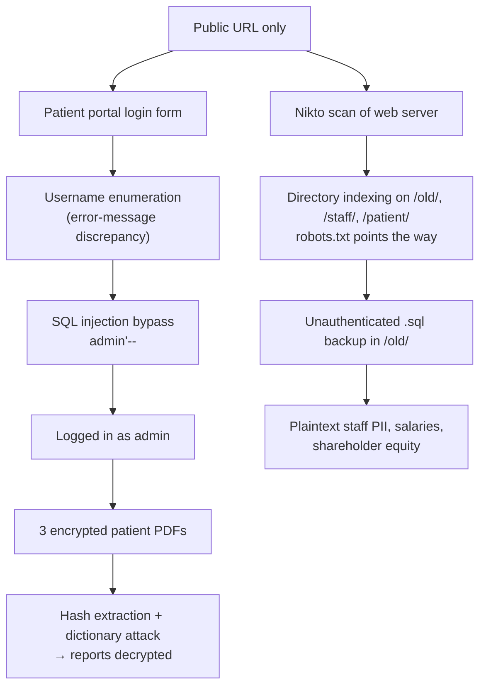

<div align="center">

# Penetration Testing Report: Mediroza General Hospital

[](https://www.linkedin.com/in/ali-abbas-qazi/)
[](https://github.com/Ali-Abbas-Qazi)

*Full black-box penetration test conducted in a controlled, authorized training environment provided by Networkwalks Academy — not a real-world engagement.*

</div>

| | |
|---|---|
| **Target** | https://medirozahospital.com |
| **Engagement** | Full black-box penetration test — 5 days |
| **Date** | September – October 2026 |
| **Author** | Ali Abbas Qazi |
| **Tools Used** | Nikto v2.6.0, Manual SQL Injection, OnlineHashCrack PDF Hash Extractor (pdf2john-based), Networkwalks Password Cracker (built-in wordlist + JTR `password.txt`), Kali Linux 2026.2 (VirtualBox) |
| **Category** | Offensive Security · Web Application Security · Penetration Testing |

> ⚠️ **Authorization:** Every technique below was run against a sandboxed training target with written permission. None of it should be used against a system you don't have explicit authorization to test.

📄 **This README is a visual walkthrough.** For the full write-up — detailed methodology, CWE references, CVSS scoring, and remediation steps — see the complete report: [`Mediroza_Pentest_Report_W4.pdf`](./Mediroza_Pentest_Report_W4.pdf).

---

## Table of Contents

- [Executive Summary](#executive-summary)
- [Skills Demonstrated](#skills-demonstrated)
- [The Attack Chain](#the-attack-chain)
- [Core Security Concepts](#core-security-concepts)
- [Finding 1: Username Enumeration + SQL Injection Bypass](#finding-1-username-enumeration--sql-injection-bypass)
- [Finding 2: Cracking the Patient Reports](#finding-2-cracking-the-patient-reports)
- [Finding 3: Unauthenticated Database Backup](#finding-3-unauthenticated-database-backup)
- [Risk Summary](#risk-summary)
- [Security Implications & Remediation](#security-implications--remediation)
- [Lessons Learned](#lessons-learned)
- [Repo Contents](#repo-contents)

---

## Executive Summary

The engagement started from nothing but a public URL and ended with a full compromise path from an anonymous visitor to the hospital's internal HR and shareholder records. No credentials, no source code, and no specialized tooling were needed — a single tester reached unauthenticated patient data, staff PII, and confidential financial records over five days.

The attack began at the patient portal login form, which gave away which usernames existed through its error messages. A plain `admin'--` SQL injection payload then bypassed authentication outright, with no valid password required. That access exposed three password-protected patient PDFs, each of which was cracked by pulling its hash and running a dictionary attack. A follow-up Nikto scan turned up an unauthenticated database backup sitting in an indexed, unprotected directory — plaintext staff salaries, national ID numbers, and shareholder equity data, free to anyone who asked for it.

Six vulnerabilities were identified and independently rated: two Critical, two High, one Medium, one Low. The two Critical findings chain together, but either one alone would be enough to cause serious harm. The takeaway isn't any single bug — it's how a handful of ordinary misconfigurations stack into a complete breach.

## Skills Demonstrated

- Black-box web application testing from zero prior knowledge
- Username enumeration through response-discrepancy analysis
- Manual SQL injection and authentication-bypass exploitation
- PDF hash extraction (`pdf2john`-based) and dictionary-attack password recovery
- Web server reconnaissance and misconfiguration analysis with Nikto
- Sensitive-data exposure assessment (PII, salary, and equity records)
- CVSS 3.1 risk rating and CWE mapping
- Technical reporting and remediation guidance for mixed technical / executive audiences

## The Attack Chain

The engagement had two entry points that converged on the same outcome — sensitive data with no authentication in front of it. The application-layer path (left) and the server-layer path (right) were both reachable from the public internet:



---

## Core Security Concepts

### SQL Injection and Authentication Bypass

When a login form drops user input straight into its backend SQL query instead of passing it as a parameter, the input stops being *data* and becomes part of the *command*. The username field here built a query like:

```sql
SELECT * FROM users WHERE username = '[input]' AND password = '[input]'
```

Submitting `admin'--` as the username closes the string early after `admin` and turns the rest of the line — including the entire password check — into a comment:

```sql
SELECT * FROM users WHERE username = 'admin'
```

The application sees a valid row come back and treats it as a successful login, without ever verifying a password. This is CWE-89, and it's one of the oldest and best-understood web vulnerabilities there is, which is exactly why finding it in a live login form is a Critical result.

### Username Enumeration

A login form is supposed to fail the same way no matter what you type. When it says "Username not found" for one input and "Incorrect password" for another, it's quietly confirming which accounts are real. On its own that's only Medium severity, but it hands an attacker a verified target list before they ever start guessing passwords — which makes every later attack more efficient.

### Why `robots.txt` Is Not Access Control

`robots.txt` tells search-engine crawlers which paths to skip. It has no power to actually block access — anyone can read the file directly. So when a site lists `/old/`, `/staff/`, and `/patient/` as disallowed, it isn't hiding them. It's publishing a short, curated map of the exact directories the owner considers sensitive, which is the first place a tester will look.

### Encryption Doesn't Help if the Password Is Weak

The patient PDFs were genuinely encrypted (RC4-128). That sounds reassuring until you look at the passwords: `123456`, `password`, and `!@#$%^&`. The hash-extraction step reads structural metadata from the file without touching the encrypted content, and from there a dictionary attack just tests guesses until one matches. Strong encryption around a weak, guessable password buys almost nothing.

---

## Finding 1: Username Enumeration + SQL Injection Bypass

The login form behaved differently depending on whether a username existed, which alone is enough to let someone build a list of valid accounts:


<p align="center"><sub>1. Username Not found.png</sub></p>


<p align="center"><sub>2. Username Found, Wrong Password.png</sub></p>

The real problem was underneath: the username field went straight into the SQL query unsanitized. Typing `admin'--` closed the string early and commented out the password check entirely.


<p align="center"><sub>3. SQLInjection on login page.png</sub></p>

That logged me in as admin with zero valid credentials and surfaced three encrypted patient lab reports:


<p align="center"><sub>4. Reports Found.png</sub></p>

## Finding 2: Cracking the Patient Reports

Each PDF's `$pdf$` hash was extracted and saved to `hash1.txt`, `hash2.txt`, `hash3.txt`:


<p align="center"><sub>5. Find hashes for all PDF files.png</sub></p>

Report 1 and Report 2 fell to the cracker's built-in 100-word list almost immediately:


<p align="center"><sub>6a. hash1 cracked.png</sub></p>


<p align="center"><sub>6a. Patient Report 1.png</sub></p>


<p align="center"><sub>6b. hash2 cracked.png</sub></p>


<p align="center"><sub>6b. Patient Report 2.png</sub></p>

Report 3's password wasn't in the built-in list, so I uploaded JTR's default `password.txt` instead — that cracked it:


<p align="center"><sub>6c. hash3 cracked.png</sub></p>


<p align="center"><sub>6c. Patient Report 3.png</sub></p>

All three passwords — a number sequence (`123456`), a dictionary word (`password`), and a short keyboard string (`!@#$%^&`) — show the encryption wasn't doing much once the hash was out.

## Finding 3: Unauthenticated Database Backup

Running `nikto -h https://medirozahospital.com/` turned up directory indexing on three paths, with `robots.txt` disallowing (and so advertising) all of them:


<p align="center"><sub>7. Found directories.png</sub></p>

`/old/` was the one that mattered — it served a raw `.sql` backup to anyone who asked, no login required:


<p align="center"><sub>8. Unprotected Backup data found.png</sub></p>


<p align="center"><sub>8. Raw Unprotected BackUp Data.png</sub></p>

The backup (`mediroza_db_backup_2019.sql`, full dump in [`9. Raw Unprotected BackUp Data.txt`](<9. Raw Unprotected BackUp Data.txt>)) held two complete plaintext tables: 30 staff records (names, roles, national ID numbers, contact details, and monthly salaries) and 10 shareholder records with ownership percentages. Each staff record also carried a government-format national ID number and direct contact details — these are left out of the tables below and not reproduced here, since their presence in the dump is the point, not their contents. Salary and equity figures are shown in full. For a clean, structured extract of the shareholder table and the doctor salaries, see [`Exposed_Data_Summary.txt`](<Exposed_Data_Summary.txt>).

### Exposed Doctor Salary Data

The salaries of all eight medical doctors in the dump, highest to lowest:

| Name | Role | Department | Monthly Salary (ZAR) | Date Joined |
|---|---|---|---|---|
| Dr. Johan van der Merwe | Medical Director | Management | R 160,000 | 2007-01-22 |
| Dr. Rajesh Naidoo | Chief Pathologist | Diagnostics Lab | R 138,000 | 2009-03-16 |
| Dr. Vikram Chetty | Anaesthetist | Theatre | R 135,000 | 2011-06-13 |
| Dr. Anita Naicker | Consultant Cardiologist | Cardiology | R 132,000 | 2012-09-10 |
| Dr. Suresh Moodley | Consultant Radiologist | Radiology | R 130,000 | 2012-02-28 |
| Dr. Ahmed Kara | Consultant Physician | Internal Medicine | R 128,000 | 2013-02-18 |
| Dr. Fatima Patel | Pediatrician | Pediatrics | R 118,000 | 2013-10-17 |
| Dr. Yusuf Cassim | Senior Registrar | Emergency & Trauma | R 74,000 | 2018-05-04 |

*(The dump also exposed 22 non-doctor staff — nurses, pharmacists, IT, finance, admin — for 30 records in total.)*

### Exposed Shareholder Data

The full capitalization table — 10 equity holders whose percentages sum to exactly 100%, confirming this is the complete, unredacted ownership structure:

| # | Shareholder | Share % | Shares Held | Share Class |
|---|---|---|---|---|
| 1 | Dr. Rajesh Naidoo | 18.00% | 180,000 | Ordinary |
| 2 | Cedar Health Holdings (Pty) Ltd | 15.00% | 150,000 | Ordinary |
| 3 | Dr. Johan van der Merwe | 12.00% | 120,000 | Ordinary |
| 4 | Reddy Family Trust | 11.00% | 110,000 | Ordinary |
| 5 | Thabo Molefe | 10.00% | 100,000 | Ordinary |
| 6 | Sarah Botha | 9.00% | 90,000 | Ordinary |
| 7 | Dr. Ahmed Kara | 8.00% | 80,000 | Preferential |
| 8 | Naledi Zulu | 7.00% | 70,000 | Ordinary |
| 9 | Michael Roberts | 6.00% | 60,000 | Ordinary |
| 10 | Dr. Vikram Chetty | 4.00% | 40,000 | Preferential |

Worth noting that several names appear in both tables — Dr. Naidoo, Dr. van der Merwe, Dr. Kara, and Dr. Chetty each draw a salary *and* hold equity, so the same file links a person's pay to their ownership stake in the hospital. The full breakdown and risk ratings for this and every other finding are in the report linked at the top.

---

## Risk Summary

Each finding is rated independently using CVSS 3.1, reflecting both how easily it was exploited and how sensitive the data or access it exposed.

| ID | Finding | Risk | CVSS 3.1 | CWE |
|---|---|---|---|---|
| VLN-01 | Username Enumeration on Patient Portal Login | Medium | 5.3 | CWE-204 |
| VLN-02 | Authentication Bypass via SQL Injection | **Critical** | 9.8 | CWE-89 |
| VLN-03 | Weak Cryptographic Controls on Patient PDFs | High | 7.5 | CWE-521 |
| VLN-04 | Directory Indexing Enabled | High | 7.5 | CWE-548 |
| VLN-05 | Publicly Accessible Database Backup | **Critical** | 9.1 | CWE-532 / CWE-200 |
| VLN-06 | Missing HTTP Security Headers | Low | 3.1 | CWE-693 |

**Distribution:** 2 Critical · 2 High · 1 Medium · 1 Low — **overall engagement risk: Critical.**

---

## Security Implications & Remediation

The headline fixes, ordered by priority:

- **Parameterize every database query (VLN-02).** Never concatenate user input into SQL. Prepared statements turn the injection payload back into harmless text. Run the app's DB account at least privilege as a backstop.
- **Get backups out of the web root (VLN-05).** No backup file should ever be reachable by a public URL. Store them on internal-only, authenticated storage, encrypt at rest, and set a retention policy so stale dumps like a 2019 file don't linger.
- **Stop relying on PDF passwords for sensitive documents (VLN-03).** Enforce strong, randomly generated passphrases, upgrade to AES-256, and ideally deliver reports through an authenticated channel instead of a static password that can be cracked offline.
- **Disable directory indexing site-wide (VLN-04)** and stop listing sensitive paths in `robots.txt`.
- **Return one generic error for every failed login (VLN-01)** and add rate limiting, so the form stops confirming which accounts exist.
- **Add the missing security headers (VLN-06)** — CSP, `X-Content-Type-Options`, HSTS, `Referrer-Policy`, `Permissions-Policy` — to shrink the blast radius of any future client-side bug.

Given the volume of staff PII and national ID data exposed, a real version of this would also trigger a review of breach-notification obligations under applicable data-protection law (POPIA, in a South African context).

---

## Lessons Learned

The thing that stuck with me from this one was how little the attack actually required. There was no clever exploit chain or custom tooling — just a login form that trusted its input, a backup left in the open, and three passwords a wordlist could guess in seconds. Each issue is forgettable on its own. Stacked together, they walk straight from "anonymous visitor" to "here are everyone's salaries and ID numbers."

It also tied the earlier weeks together in a way I didn't expect. The recon mindset from Week 2 is what made me revisit the Nikto output after the portal was already compromised, and the password-cracking work from Week 3 was exactly the technique that opened the patient PDFs here. If I ran it again, I'd spend more time mapping the `/patient/` application files I found but didn't fully chase, since that's where a deeper foothold likely was.

---

## Repo Contents

- `*.png` — screenshots for each step above
- `hash1.txt` / `hash2.txt` / `hash3.txt` / `hashes.txt` — extracted PDF hashes
- `9. Raw Unprotected BackUp Data.txt` — full SQL backup dump recovered from `/old/`
- `Exposed_Data_Summary.txt` — restructured shareholder and doctor-salary tables from the backup
- `Mediroza_Pentest_Report_W4.pdf` / `.docx` — full report with findings, risk ratings, and remediation
